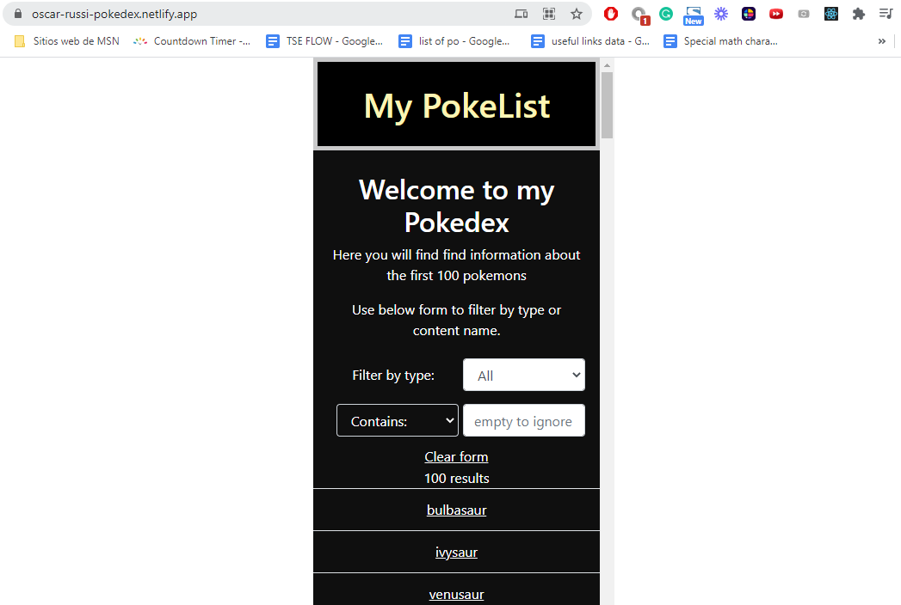

# catalogue-react

This is the react capstone project, for Microverse academy, By Oscar Russi

# What it does

- This is a Pokedex with information about the first 100 pokemon
- The root page displays the list of the 100 pokemon
- The root page has a filter form that let you filter by type and pokemon name content
- The filter by name content has a selection to choose how you want to match the name content (contains, starts, ends, or find exact), so for example, if you choose "starts" in the select and type 'p' in the input then it will show only the pokemon whose first letter is p.
- If you don't type anything in the input then the name content filter will be ignored.
- By default, the type filter has selected the option 'All'.  
- By clicking in a pokemon's name on the list you can be redirected to the details page
- You can also go directly to pokemon details by typing at the end of the URL: '/details:id' where id is an integer among the inclusive range of 0 and 99, each integer is the id of a pokemon in the list.
- The pokemon details page shows the pokemon name, types, abilities, and image.
- The form has a "clear form" option to undo all the filters. 
- The data was originally taken from this public free API: [pokeapi](https://pokeapi.co/).
- Just for practice purposes I took some information from the pokeapi site and make my own API.
- The design was partially taken from this one: [NomNom, by Marc-Antoine Roy](https://www.behance.net/gallery/11351281/NomNom).
- It has tests for all the components build with testing-library/react.
- The project is deployed with Netlify.

# Build with

- [React](https://reactjs.org/)
- [Webpack](https://webpack.js.org/)
- [npm](https://www.npmjs.com/)
- [Netlify](https://www.netlify.com/)
- [Redux](https://redux.js.org/)
- [pokeapi](https://pokeapi.co/)
- [NomNom, by Marc-Antoine Roy](https://www.behance.net/gallery/11351281/NomNom)

# Live demo

[Live Demo](https://oscar-russi-pokedex.netlify.app/)

# Video presentation

[Link Video](https://drive.google.com/file/d/1BujPsXi8hR6dedO0t1Rq62ePxRQjkrBH/view) 

# How to set up this project

- Download this project or install running the next command in the terminal: https://github.com/andresporras3423/catalogue-react.git
- Move to the folder catalogue-react
- In the terminal, run: npm install
- In the terminal, run: npm start

# How to run the tests

- After setting up the project, you can run tests with the next command: npm test

#### and deployed to GitHub

## Authors

**Oscar Russi**
- Github: [@andresporras3423](https://github.com/andresporras3423/)
- Linkedin: [Oscar Russi](https://www.linkedin.com/in/oscar-andres-russi-porras)

## � Contributing

This is a project for educational purposes only. We are not accepting contributions.

## Attributions and Credit

Special thanks to Microverse, for this learning opportunity. 

## Show your support

Give a ⭐️ if you like this project!

## Enjoy!